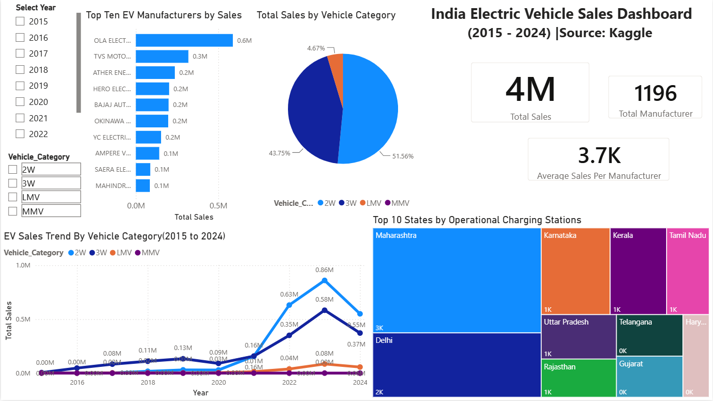

# 🚗 Indian EV Sales Dashboard (2015–2024)

## 📌 Overview

This Power BI dashboard provides an interactive analysis of India's Electric Vehicle (EV) sales from **2015 to 2024**. The dashboard was developed using Power BI to transform raw EV data into meaningful business insights through interactive visualizations and KPIs.

---

## 📊 Dashboard Highlights

- Total EV Sales
- Total EV Manufacturers
- Average Sales per Manufacturer
- Top 10 EV Manufacturers by Sales
- EV Sales Trend (2015–2024)
- Sales Distribution by Vehicle Category
- Top 10 States by Operational Charging Stations
- Interactive filters for Year and Vehicle Category

---

## 🛠️ Tools & Technologies

- Power BI Desktop
- Power Query
- DAX
- Microsoft Excel

---

## 📂 Dataset

**Source:** Kaggle – Vahan EV Dataset

The dataset includes:
- EV sales by manufacturer
- Vehicle category-wise registrations
- Operational charging stations by state
- EV registrations over time

---

## 🔍 Key Insights

- Two-wheelers (2W) account for the highest share of EV sales.
- OLA Electric is the leading EV manufacturer by total sales.
- Maharashtra has the largest operational charging infrastructure.
- EV adoption experienced significant growth after 2021.
- Two-wheelers and three-wheelers dominate India's EV market.

---

## 📸 Dashboard Preview

---

## 🚀 Future Improvements

- Add forecasting for future EV sales.
- Build state-wise drill-through reports.
- Include charging station growth trends.
- Publish the dashboard using Power BI Service.

---

## 👩‍💻 Author

**Shanmathi Sampath**

Aspiring Data Analyst | SQL | Excel | Power BI
